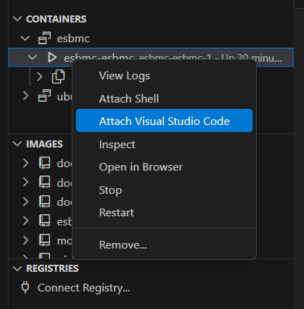

# 🚀 Docker Image - ESBMC 7.8.1 trên Ubuntu 24.04

📝 Đây là một **Docker image** đã được cài đặt **ESBMC phiên bản 7.8.1** trên hệ điều hành **Ubuntu 24.04**.
Sử dụng Docker giúp bạn **tránh các vấn đề về hệ điều hành và cài đặt thư viện**, đảm bảo môi trường phát triển nhất quán.

---

## 👍 Hướng dẫn cài đặt

### 🔹 Yêu cầu
- **Phần mềm**: Docker, Docker Desktop
- **IDE**: Visual Studio Code
- **Extensions cần thiết**:
  - Remote - SSH
  - Dev Containers
  - Docker

### 🔹 Các bước cài đặt
1. **Clone repository**:
   ```bash
   git clone https://github.com/thinhle96/esbmc.git
   ```
2. **Chạy Docker Compose**:
   ```bash
   docker compose up -d
   ```
3. **Mở VS Code và kết nối với container**:
   - Chọn mục **Docker** từ thanh menu bên trái.
   - Chuột phải vào container -> **Attach Visual Studio Code**.
   - Khi cửa sổ VS Code mở ra, vào **File > Open Folder**, chọn thư mục **`/workspace`**.

   

---

## ▶️ Hướng dẫn chạy ESBMC
1. **Di chuyển vào thư mục làm việc**:
   ```bash
   cd /workspace/esbmc-demo
   ```
2. **Chạy ESBMC với `k-induction`**:
   ```bash
   esbmc sample.c --k-induction
   ```

---

## ⚠️ Lưu ý
- **Thư mục `/workspace` đã chứa thư mục code**: `esbmc-demo`.
- **Nên viết code trong thư mục `/workspace`** để tránh mất dữ liệu khi container bị xóa, vì thư mục này đã được mount với Docker Volumes.

---

# 🚀 Docker Image - ESBMC 7.8.1 on Ubuntu 24.04

This is a **Docker image** with **ESBMC version 7.8.1** installed on **Ubuntu 24.04**.
Using Docker **eliminates concerns** about OS compatibility and library dependencies, ensuring a consistent development environment.

---

## 👍 Installation Guide

### 🔹 Requirements
- **Software**: Docker, Docker Desktop
- **IDE**: Visual Studio Code
- **Required Extensions**:
  - Remote - SSH
  - Dev Containers
  - Docker

### 🔹 Installation Steps
1. **Clone the repository**:
   ```bash
   git clone <repo_url>
   ```
2. **Start Docker Compose**:
   ```bash
   docker compose up -d
   ```
3. **Open VS Code and connect to the container**:
   - Open **Docker** from the left menu.
   - Right-click on the container -> **Attach Visual Studio Code**.
   - When VS Code opens, go to **File > Open Folder** and select **`/workspace`**.

   

---

## ▶️ Running ESBMC
1. **Navigate to the working directory**:
   ```bash
   cd /workspace/esbmc-demo
   ```
2. **Run ESBMC with `k-induction`**:
   ```bash
   esbmc sample.c --k-induction
   ```

---

## ⚠️ Notes
- **The `/workspace` directory already contains the code folder**: `esbmc-demo`.
- **You should write code inside `/workspace`** since it is mounted as a Docker Volume, preventing data loss if the container is removed.

